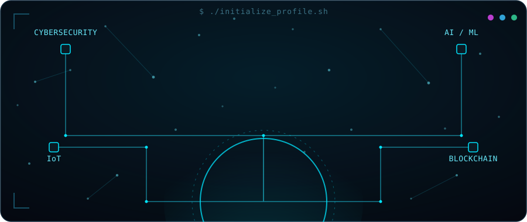

<!-- ================================================================== -->
<!--  BHANU PRAKASH — GITHUB PROFILE README                            -->
<!--  Repo must be named exactly your GitHub username, e.g.            -->
<!--  github.com/thammubhanuprakash/thammubhanuprakash                -->
<!-- ================================================================== -->

<div align="center">

<!-- ============ HERO: PARTICLE / CIRCUIT ARTWORK ============ -->


<!-- ============ PROFILE PHOTO ============ -->
<!-- 🔴 REPLACE: put your circular-cropped photo at assets/profile.png (transparent background PNG, ~500x500px, already cropped to a circle) -->


<br/>

# Bhanu Prakash

<!-- 🔴 REPLACE: username=thammubhanuprakash with your GitHub username -->


**@thammubhanuprakash** &nbsp;•&nbsp; 3rd Year B.Tech (CSE – Cyber Security) &nbsp;•&nbsp; India

<p>
<a href="https://github.com/thammubhanuprakash"></a>
<a href="https://linkedin.com/in/bhanu-prakash"></a>
<!-- 🔴 REPLACE: add your portfolio URL, resume URL and Twitter/X handle if you have them -->
<a href="https://your-portfolio-url.com"></a>
<a href="https://your-resume-url.com"></a>
<a href="mailto:bhanuprakash080803@gmail.com"></a>
</p>

</div>

<div align="center">

```yaml
$ whoami
> name       : Bhanu Prakash
> username   : thammubhanuprakash
> role       : Cybersecurity Student
> focus      : IoT, AI/ML, Blockchain
> status     : Building the future
> location   : India
> education  : B.Tech (CSE - Cyber Security)
> passion    : IoT & Embedded Systems, AI/ML, Blockchain,
               Open Source, Ethical Hacking, Automation
```

</div>


##  About Me

```
I build secure, smart, and intelligent solutions
that make a real-world impact.
```

<!-- 🔴 EDIT: this bio and the goals/fun fact below are drafted from your profile — tweak the wording to sound like you -->
I'm a **Cybersecurity student** passionate about the intersection of **IoT, AI/ML, and Blockchain**. I like breaking things to understand them, then building them back — more secure and more useful. Currently exploring embedded security, ethical hacking, and applying AI to real-world hardware problems, with 25+ repositories and 350+ commits shipped so far.

**🎯 Career Goals:** Looking for opportunities as a **Cybersecurity / IoT Security intern or entry-level engineer**, where I can apply ethical hacking and secure-systems thinking to real embedded and networked products.

**💡 Interests**
- Cybersecurity & Ethical Hacking
- IoT & Embedded Systems
- AI / Machine Learning

**⚡ Fun Fact:** I'd rather find the vulnerability in my own project before anyone else does — most of my builds get "attacked" by me first.


##  Technical Skills

<table align="center">
<tr>
<td valign="top" width="20%">

**🛡️ Cybersecurity**
<br/>
<br/>
<br/>
<br/>


</td>
<td valign="top" width="20%">

**📡 IoT / Embedded**
<br/>
<br/>
<br/>
<br/>


</td>
<td valign="top" width="20%">

**🧠 AI / ML**
<br/>
<br/>
<br/>
<br/>


</td>
<td valign="top" width="20%">

**🔗 Blockchain**
<br/>
<br/>
<br/>


</td>
<td valign="top" width="20%">

**💻 Languages & Tools**
<br/>
<br/>
<br/>
<br/>


</td>
</tr>
</table>


##  Featured Projects

<!-- 🔴 REPLACE: each "#" below with your real GitHub repo / live demo links -->
<table align="center" width="100%">
<tr>
<td width="50%" valign="top">

### ☀️ Smart Solar Blinds
IoT-based solar blinds with rain detection, automatic sun-tracking control, manual override, and Blynk IoT app integration.

`ESP32` `IoT` `Blynk`

[🔗 Repo](#) · [🌐 Demo](#)

</td>
<td width="50%" valign="top">

### 🧹 Solar Panel Dust Cleaner
Automated solar panel cleaning system using dust, voltage, and current sensors to trigger cleaning cycles and maximize output.

`ESP32` `Sensors` `Relay`

[🔗 Repo](#) · [🌐 Demo](#)

</td>
</tr>
<tr>
<td width="50%" valign="top">

### 💧 Smart Drainage System
Smart drainage monitoring using an ultrasonic sensor with a live IoT dashboard for real-time overflow alerts and updates.

`ESP32` `IoT` `Web`

[🔗 Repo](#) · [🌐 Demo](#)

</td>
<td width="50%" valign="top">

### 🚗 RoadVolt AI
AI-powered system for vehicle detection and road monitoring using computer vision.

`AI/ML` `Python` `OpenCV`

[🔗 Repo](#) · [🌐 Demo](#)

</td>
</tr>
</table>

<div align="center">

🔗 **More projects on my repositories →** [github.com/thammubhanuprakash](https://github.com/thammubhanuprakash?tab=repositories)

</div>


##  GitHub Statistics

<div align="center">

<!-- 🔴 REPLACE: username=thammubhanuprakash with your GitHub username in all three URLs below -->


</div>


##  Achievements & Certifications

<!-- 🔴 REPLACE: add your real certifications/achievements — examples shown below -->
- 🏅 [Certification / Achievement 1]
- 🏅 [Certification / Achievement 2]
- 🏅 [Certification / Achievement 3]


##  Currently Learning

<!-- 🔴 REPLACE: swap in whatever you're actually studying right now -->


##  Current Focus

- 🛡️ Deepening skills in **Cybersecurity** & **Ethical Hacking**
- 📡 Securing **IoT** devices and embedded systems
- 🤖 Applying **AI/ML** to real-world hardware problems
- 🔗 Exploring **Blockchain** for secure decentralized systems
- 🌱 Contributing to open-source security tooling

##  Open to Collaborate On

- 🌍 Open-source projects
- 💼 Freelance opportunities
- 🔬 Research projects
- 🚀 Startup ideas


<div align="center">

##  Connect With Me

<!-- 🔴 REPLACE: all URLs and handles below with your real links -->
<a href="https://github.com/thammubhanuprakash"></a>
<a href="https://linkedin.com/in/bhanu-prakash"></a>
<a href="https://instagram.com/bhanu_prakash_08"></a>
<a href="https://youtube.com/@BhanuPrakash"></a>
<a href="mailto:bhanuprakash080803@gmail.com"></a>

<br/><br/>

**⚡ Code. Secure. Innovate. Automate. Make an Impact. ⚡**


</div>
